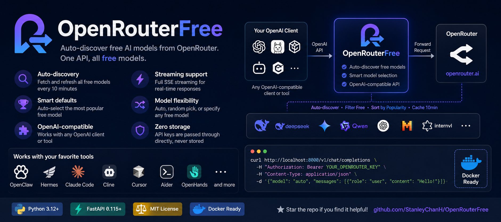

<div align="center">

# OpenRouterFree

**Auto-discover free AI models from OpenRouter. One API, all free models.**

[](https://www.python.org/downloads/)
[](https://fastapi.tiangolo.com/)
[](LICENSE)
[](Dockerfile)

[English](#features) · [中文文档](README_CN.md)

</div>

<div align="center">

</div>

---

OpenRouterFree is a lightweight reverse proxy that automatically discovers **all free AI models** from [OpenRouter](https://openrouter.ai) and exposes them through a **fully OpenAI-compatible API**. Just point any OpenAI client at it and start using free models immediately.

## Features

- **Auto-discovery** — Fetches all free models from OpenRouter and keeps them cached (refreshed every 10 minutes)
- **Smart defaults** — Automatically selects the most popular free model (ranked by weekly token usage)
- **OpenAI-compatible** — Drop-in replacement for any OpenAI client library or tool
- **Streaming support** — Full SSE streaming support for real-time responses
- **Model flexibility** — Use auto-selection, random pick, or specify a particular model
- **Zero storage** — API keys are passed through directly, never stored
- **Docker-ready** — Single command deployment with Docker Compose

## Quick Start

### Option 1: Direct Run

```bash
# Clone the repository
git clone https://github.com/StanleyChanH/OpenRouterFree.git
cd OpenRouterFree

# Install dependencies (requires uv)
uv sync

# Start the server
uv run uvicorn app.main:app
```

### Option 2: Docker

```bash
git clone https://github.com/StanleyChanH/OpenRouterFree.git
cd OpenRouterFree
docker compose up -d
```

The server starts at `http://localhost:8000`.

## Usage

### Chat Completions

```bash
curl http://localhost:8000/v1/chat/completions \
  -H "Authorization: Bearer YOUR_OPENROUTER_KEY" \
  -H "Content-Type: application/json" \
  -d '{
    "model": "auto",
    "messages": [{"role": "user", "content": "Hello!"}]
  }'
```

**Model field options:**

| Value | Behavior |
|-------|----------|
| `"auto"` or omitted | Use the most popular free model (by weekly tokens) |
| `"free-random"` | Randomly pick from available free models |
| Specific model ID | Use that exact model (e.g., `deepseek/deepseek-v4-flash:free`) |

### Streaming

```bash
curl http://localhost:8000/v1/chat/completions \
  -H "Authorization: Bearer YOUR_OPENROUTER_KEY" \
  -H "Content-Type: application/json" \
  -d '{
    "model": "auto",
    "stream": true,
    "messages": [{"role": "user", "content": "Tell me a story"}]
  }'
```

### List Free Models

```bash
curl http://localhost:8000/v1/models | jq
```

Response:
```json
{
  "object": "list",
  "data": [
    {
      "id": "deepseek/deepseek-v4-flash:free",
      "object": "model",
      "created": 1777000666,
      "owned_by": "openrouter-free-proxy",
      "context_length": 1048576
    }
  ]
}
```

### Get Single Model

```bash
curl http://localhost:8000/v1/models/deepseek/deepseek-v4-flash:free | jq
```

### Using with OpenAI SDK (Python)

```python
from openai import OpenAI

client = OpenAI(
    base_url="http://localhost:8000/v1",
    api_key="YOUR_OPENROUTER_KEY"  # NOT needed for /v1/models
)

# Auto-select the best free model
response = client.chat.completions.create(
    model="auto",
    messages=[{"role": "user", "content": "Hello!"}]
)
print(response.choices[0].message.content)
```

### Using with Other Clients

Works with any OpenAI-compatible client. Just set the base URL:

| Client | Base URL |
|--------|----------|
| ChatGPT-Next-Web | `http://localhost:8000` |
| LobeChat | `http://localhost:8000/v1` |
| LibreChat | `http://localhost:8000/v1` |
| Any OpenAI SDK | Set `base_url` to `http://localhost:8000/v1` |

## Integration with Agent Frameworks

### OpenClaw

OpenClaw supports custom OpenAI-compatible providers. Edit your `config.yaml`:

```yaml
models:
  providers:
    openrouter-free:
      baseUrl: http://localhost:8000/v1
      apiKey: YOUR_OPENROUTER_KEY

agents:
  defaults:
    model:
      primary: openrouter-free/auto
```

Or use the interactive setup:

```bash
openclaw onboard
# Choose "Custom Provider" → set baseUrl to http://localhost:8000/v1
```

Set `model` to `openrouter-free/auto` for auto-selection, or `openrouter-free/deepseek/deepseek-v4-flash:free` for a specific model.

### Hermes

Hermes Agent supports any OpenAI-compatible endpoint as a custom provider. Configure in your settings:

```yaml
providers:
  openrouter-free:
    type: openai
    base_url: http://localhost:8000/v1
    api_key: YOUR_OPENROUTER_KEY

default_provider: openrouter-free
default_model: auto
```

Hermes also exposes its own OpenAI-compatible API Server, so you can chain: `Hermes → OpenRouterFree → OpenRouter`.

### Claude Code

Claude Code uses the Anthropic API format natively. To use OpenRouterFree, you need a translation proxy (e.g., [claude-code-proxy](https://github.com/fuergaosi233/claude-code-proxy)):

```bash
# 1. Start OpenRouterFree
uv run uvicorn app.main:app

# 2. Start a translation proxy (converts Anthropic ↔ OpenAI format)
npx claude-code-proxy --openai-base-url http://localhost:8000/v1 --openai-api-key YOUR_OPENROUTER_KEY

# 3. Point Claude Code at the translation proxy
export ANTHROPIC_BASE_URL=http://localhost:8080
claude
```

### Cline (VS Code)

1. Open VS Code Settings → search for `cline`
2. Set **API Provider** to `OpenAI Compatible`
3. Set **Base URL** to `http://localhost:8000/v1`
4. Set **API Key** to your OpenRouter key
5. Set **Model** to `auto`

### Cursor

1. Open Settings → **Models**
2. Add an **OpenAI API Compatible** model
3. Set **Base URL** to `http://localhost:8000/v1`
4. Set **API Key** to your OpenRouter key
5. Set model name to `auto` or a specific free model ID

### Aider

```bash
pip install aider-chat
aider --openai-api-base http://localhost:8000/v1 \
      --openai-api-key YOUR_OPENROUTER_KEY \
      --model openai/auto
```

### OpenHands

Set environment variables:

```bash
export LLM_MODEL="auto"
export LLM_API_KEY="YOUR_OPENROUTER_KEY"
export LLM_BASE_URL="http://localhost:8000/v1"
```

## Configuration

| Variable | Default | Description |
|----------|---------|-------------|
| `PORT` | `8000` | Server listen port |
| `CACHE_TTL` | `600` | Model cache refresh interval in seconds |
| `OPENROUTER_BASE_URL` | `https://openrouter.ai/api/v1` | OpenRouter API base URL |

Set via environment variables or `.env` file (see [.env.example](.env.example)).

## API Reference

### `POST /v1/chat/completions`

OpenAI-compatible chat completions endpoint. Supports both streaming (`stream: true`) and non-streaming responses.

### `GET /v1/models`

Returns all currently available free models, sorted by weekly token usage (most popular first).

### `GET /v1/models/{model_id}`

Returns details for a specific free model.

## Getting an OpenRouter API Key

1. Sign up at [openrouter.ai](https://openrouter.ai)
2. Go to [Keys](https://openrouter.ai/keys) and create a new key
3. Free models don't consume credits, but an API key is still required

## Development

```bash
# Install dev dependencies
uv sync

# Run tests
uv run pytest -v

# Run with auto-reload
uv run uvicorn app.main:app --reload

# Run integration tests (requires running server and OPENROUTER_API_KEY)
OPENROUTER_API_KEY=your-key PYTHONUTF8=1 uv run python test_all.py
```

## Project Structure

```
OpenRouterFree/
├── app/
│   ├── config.py         # Environment variable configuration
│   ├── models.py         # Model cache, filtering, and sorting
│   ├── proxy.py          # Request forwarding (streaming + non-streaming)
│   └── main.py           # FastAPI app with route handlers
├── tests/
│   ├── conftest.py       # Shared test fixtures
│   ├── test_models.py    # Model cache unit tests
│   ├── test_proxy.py     # Proxy resolution tests
│   └── test_api.py       # API route integration tests
├── Dockerfile
├── docker-compose.yml
├── pyproject.toml
└── test_all.py           # Full integration test script
```

## License

[MIT](LICENSE) © StanleyChanH
